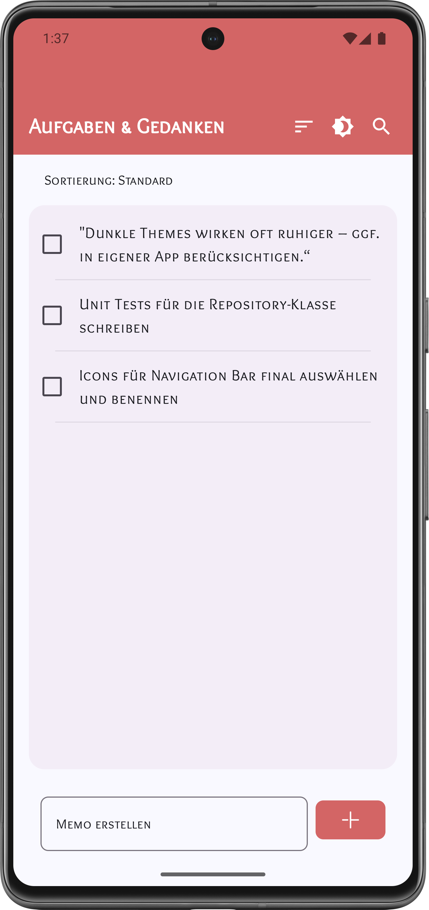
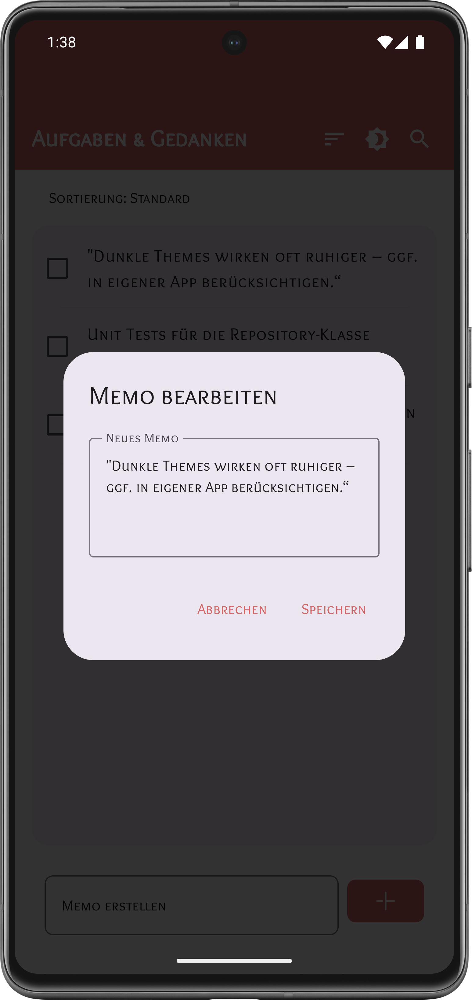
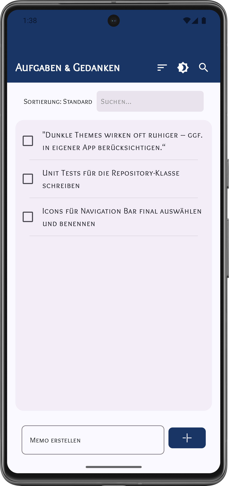
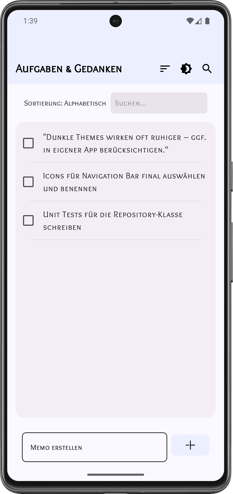

# 📝 Memora 

**Memora** ist eine minimalistische und intuitive Notizen-App mit integrierter To-Do-Funktion.  
Du kannst sowohl Gedanken als auch Aufgaben erfassen, sortieren, bearbeiten und abhaken.

---

## ✨ Funktionen

- 🟢 Notizen und Aufgaben schnell erstellen
- ✅ To-Dos abhaken
- ✏️ Notizen bearbeiten oder löschen
- 🔍 Suchfunktion für große Sammlungen
- 🗂️ Sortierung alphabetisch oder nach Erstellungsreihenfolge
- 🎨 Auswahl aus mehreren Farb-Themes

---

## 🔍 App-Vorschau

<table>
  <tr>
    <th>Übersicht</th>
    <th>Bearbeiten</th>
    <th>Theme-Auswahl</th>
  </tr>
  <tr>
    <td></td>
    <td></td>
    <td></td>
  </tr>
</table>

<table>
  <tr>
    <th>Sortieren & Suchen</th>
    <th>Helles Theme</th>
  </tr>
  <tr>
    <td></td>
    <td></td>
  </tr>
</table>

---

## 🧪 Tech Stack

- 🧱 Kotlin + Jetpack Compose (Material3)
- 📦 Room für lokale Speicherung
- 💾 DataStore für Theme-Persistenz
- 🧭 Navigation Compose
- 🎨 Eigene Themes + Google Fonts Integration

---

## 🛠️ Lokales Setup

1. Projekt in Android Studio öffnen
2. Unterstützte Android-Versionen
- Mindestanforderung: Android 11 (API-Level 30)
- Zielplattform: Android 15 (API-Level 35)
3. `gradle.properties`, `local.properties` und `.env` werden automatisch ignoriert
4. Build & Run – keine zusätzlichen Konfigurationen nötig

---

## 🔐 Sicherheit & Datenschutz

Diese App speichert **alle Daten lokal auf dem Gerät** – es erfolgt **keine Cloud-Synchronisation** oder externe Datenweitergabe.

---

## 🧠 Idee

Memora wurde als kleine, persönliche Notiz-App konzipiert, die sich auf das Wesentliche konzentriert: Gedanken erfassen, sortieren, abhaken.  
Kein Account. Keine Werbung. Kein Tracking.

---

## 📄 Lizenz

MIT License – siehe [LICENSE](LICENSE)

